# Maverick Command Core

A multi-platform automotive diagnostic suite for the **Ford Maverick**. Three apps — one purpose: full ECU visibility over Bluetooth OBD-II.

| App | Platform | Port | BLE Stack |
|-----|----------|------|-----------|
| `maverick-ecu-app` | Chrome desktop | 3009 | Web Bluetooth API |
| `obd-flux-app` | Chrome desktop + iPhone (Capacitor) | 3017 | Web BT / `@capacitor-community/bluetooth-le` |
| `maverick-obd-swift` | iPhone (native) | — | CoreBluetooth (recommended) |

---

## maverick-ecu-app — Desktop ECU Dashboard

High-contrast Next.js 15 dashboard for desktop use via Web Bluetooth. Parses Ford ECU module maps, runs DTC scans, and plots live telemetry.

### Offline state — System Bus ready

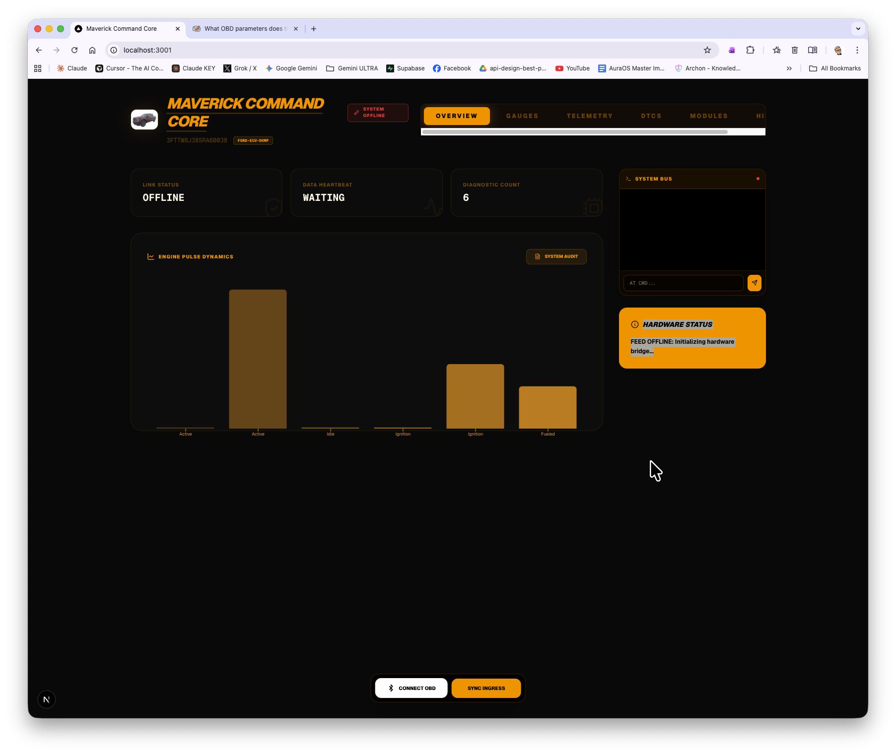

Link Status shows **OFFLINE / WAITING** on startup. The System Bus panel is live and accepts manual AT commands. Hardware Status reports `FEED OFFLINE: Initializing hardware bridge…` until a BLE adapter connects.

---

### Bluetooth pairing — IOS-Vlink detected

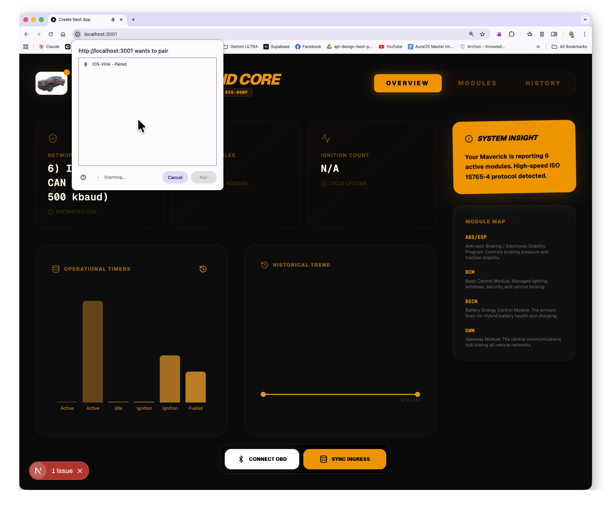

Chrome's BLE device picker appears when **CONNECT OBD** is clicked. The **IOS-Vlink** adapter is shown as already paired. The Module Map panel on the right lists all discovered ECU modules: **ABS/ESP**, **BCM**, **BECM**, **GWM**.

---

### Connected — CAN protocol identified

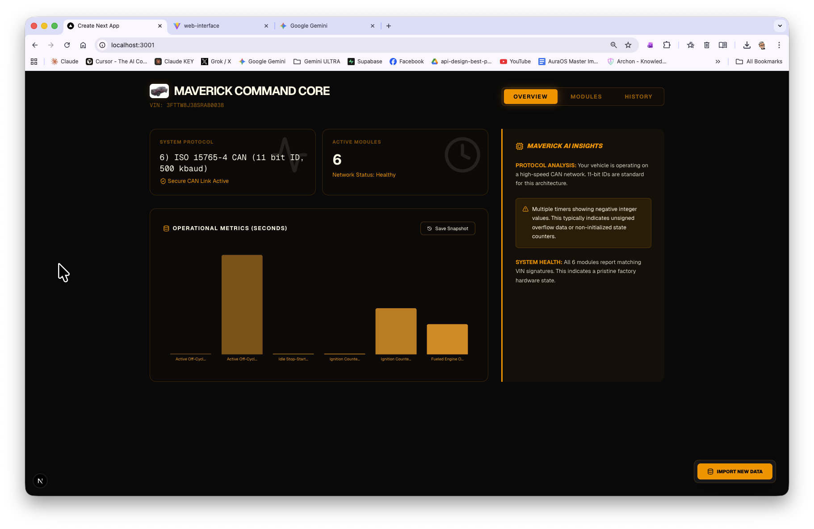

After pairing, the dashboard identifies the active CAN protocol:

```
6) ISO 15765-4 CAN (11 bit ID, 500 kbaud)
```

- **6 Active Modules** detected on the network
- **Operational Metrics** bar chart shows engine cycle counters (active, idle, ignition, fueled)
- **Maverick AI Insights** panel interprets the data: 11-bit IDs are standard for this architecture; all 6 modules report matching VIN signatures — pristine factory hardware state

---

### Live gauges + Diagnostic Bus

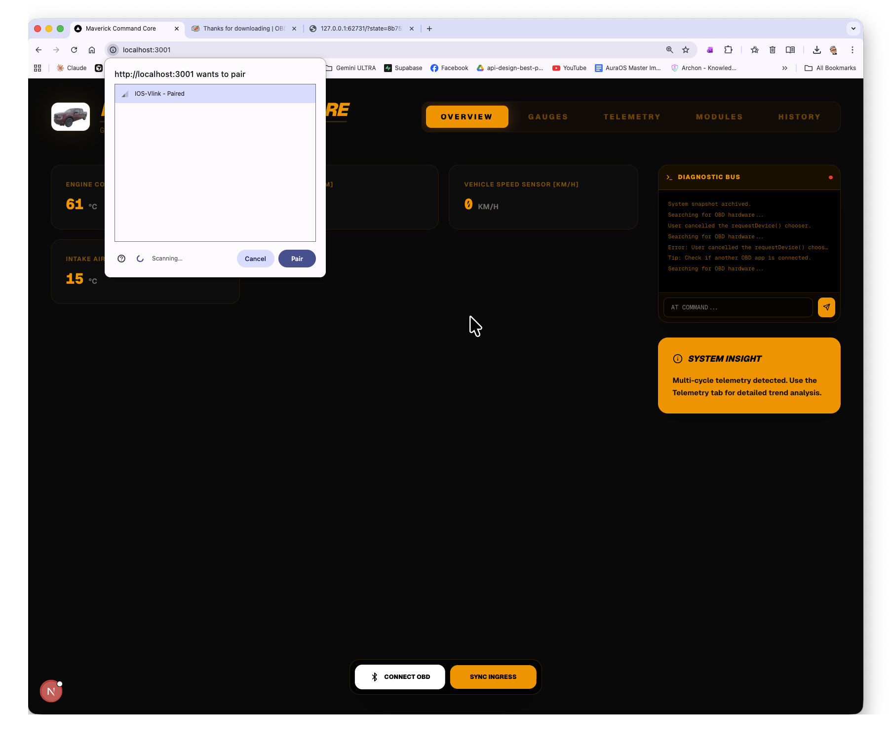

Overview tab with live OBD gauges (Engine Coolant, Intake Air, Speed) and the **Diagnostic Bus** log visible on the right — shows BLE discovery attempts, cancellations, and retry cycle.

---

### DTC scan — fault code B1B25

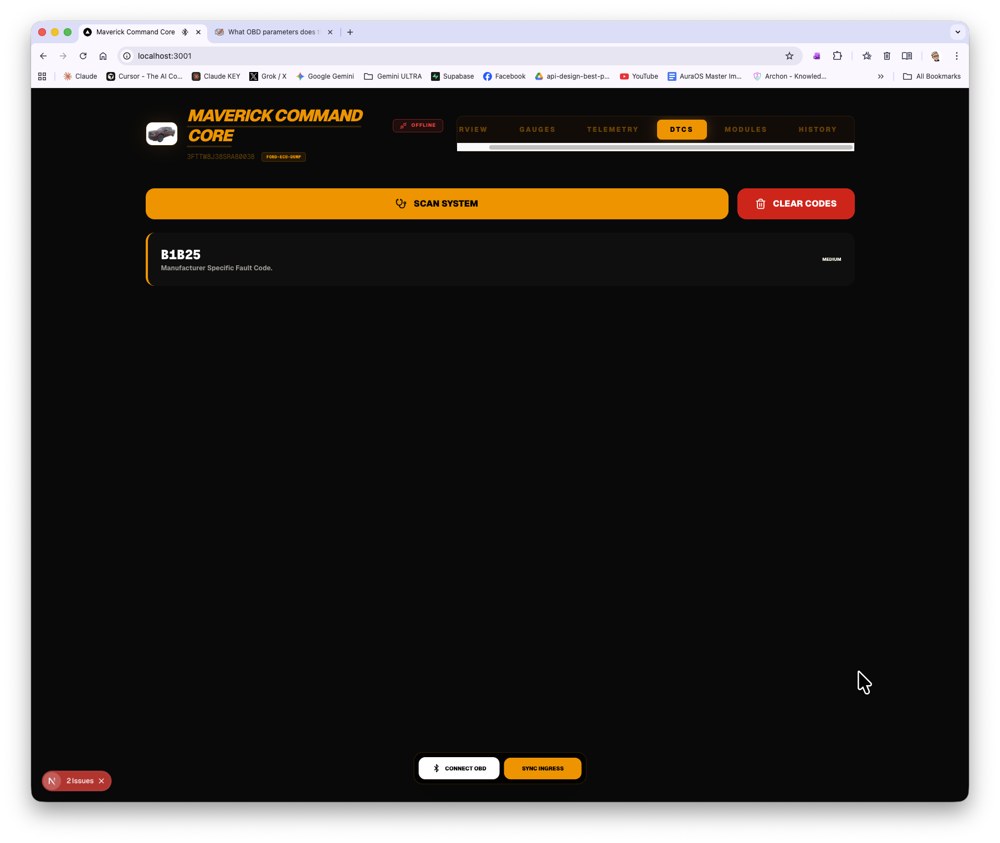

The **DTCS** tab runs a system scan and surfaces stored fault codes. Here: **B1B25** (Manufacturer Specific Fault Code, MEDIUM severity). Codes can be cleared with the **CLEAR CODES** button.

---

### Start

```bash
cd maverick-ecu-app
npm install
PORT=3009 npm run dev
```

Open Chrome → `http://localhost:3009` → click **CONNECT OBD**.

> Web Bluetooth requires Chrome on desktop (HTTPS or localhost). Not supported in Firefox or Safari.

---

## obd-flux-app — OBD Flux Console

Capacitor-wrapped Next.js app. Runs as a web preview on desktop; compiles to a native iPhone app via Xcode.

### Standby — BLE adapter not connected

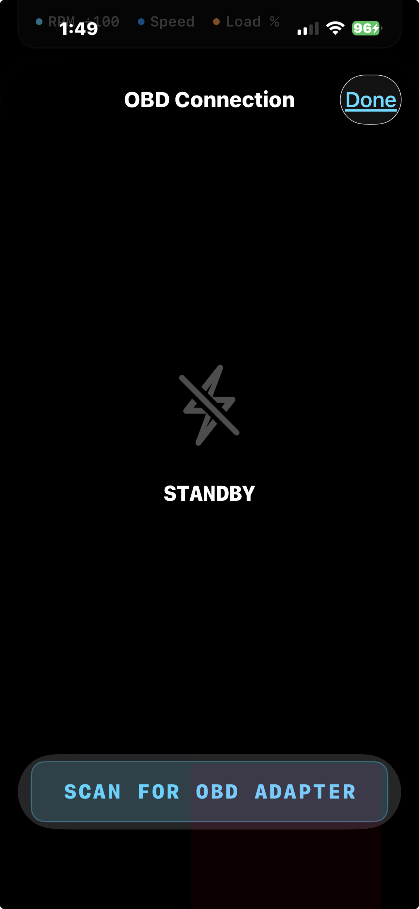

Connection modal in **STANDBY** state before scanning. Shows adapter profile options and the Connect button.

---

### Scanning — searching for BLE adapter

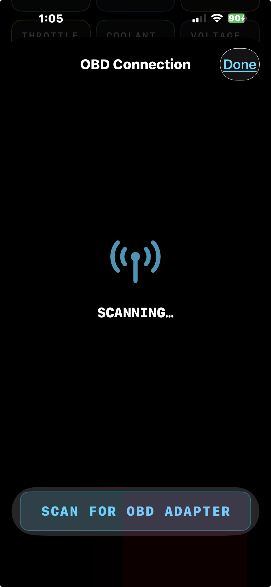

**SCANNING** state with the radio animation active. Chrome's BLE requestDevice dialog is open in the background.

---

### Dashboard — offline, BLE stack ready

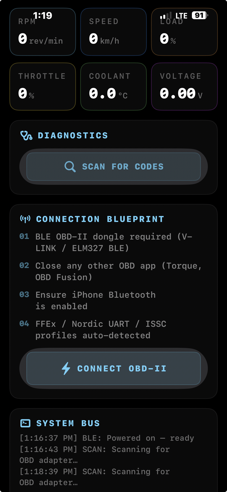

Main dashboard in **STANDBY** mode. The System Bus panel confirms BLE is powered on. The **CONNECT OBD-II** button is ready. All gauge tiles show `—` until a live connection is established.

---

### Connected — TX/RX trace visible

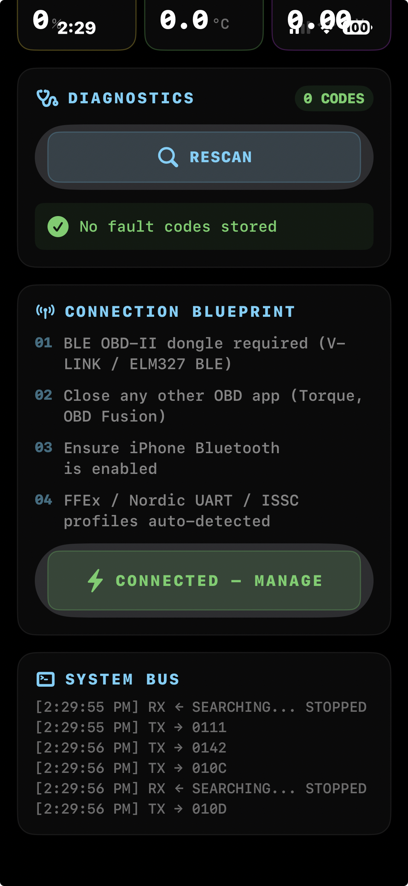

Live connection to the **IOS-Vlink** adapter. The System Bus log shows the full ELM327 handshake:

- **Cyan** lines → `TX →` commands sent to adapter
- **Green** lines → `RX ←` responses received
- **Yellow** lines → `INIT` / `PROF` / `SCAN` status messages

The `SEARCHING... STOPPED` response from the adapter is normal when **ignition is off** — the ELM327 found no CAN bus activity. DTC count shows **0 CODES** (clean).

---

### Diagnostics + System Bus log

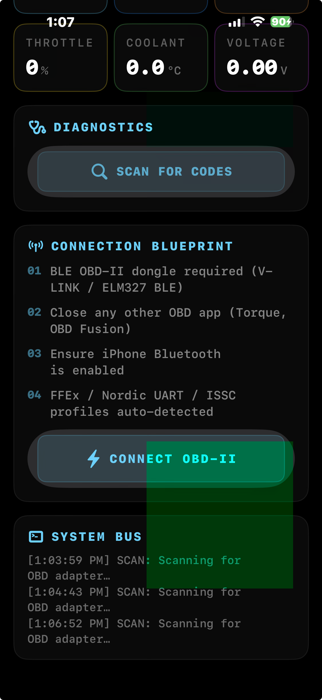

System Bus log during a diagnostics scan. Yellow `SCAN` entries show the adapter cycling through OBD modes to enumerate fault codes and live PIDs.

---

### Start (web preview)

```bash
cd obd-flux-app
npm install
PORT=3017 npm run dev
```

### Build iOS app

```bash
cd obd-flux-app
npm run build          # static export → out/
npx cap sync           # copies to iOS project
npx cap open ios       # opens Xcode
```

Select your iPhone → **⌘R**.

> BLE does not work in the iOS Simulator. Use a physical device.

---

## maverick-obd-swift — Native iPhone App ⭐ Recommended

Pure Swift app using CoreBluetooth directly — no WebView, no Capacitor bridge. Best choice for in-car use: reliable BLE reconnection, background mode, lower power draw, native iOS feel.

**Stack:** SwiftUI + Swift Charts + CoreBluetooth
**Minimum iOS:** 16.0

### Live OBD data — combined chart

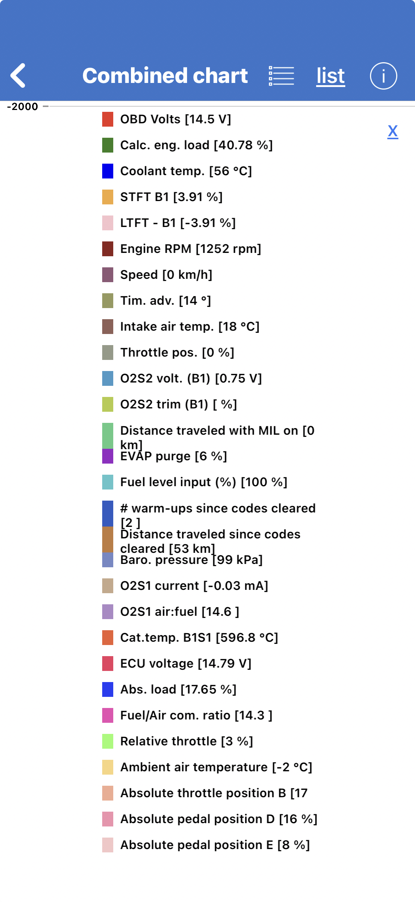

Combined chart view listing all active OBD PIDs with live values:

- OBD Volts: **14.5 V** / ECU Voltage: **14.79 V**
- Engine RPM: **1252 rpm** / Engine Load: **40.78 %**
- Coolant Temp: **56 °C** / Intake Air: **18 °C**
- Fuel Level: **100 %** / Throttle: **0 %**
- Cat Temp B1S1: **596.8 °C**

---

### iPhone setup — Trust Developer

First run requires trusting the development certificate on-device:

| Step 1 — Device Management | Step 2 — Trust Developer |
|:--------------------------:|:------------------------:|
| 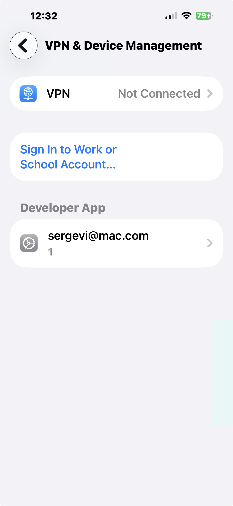 | 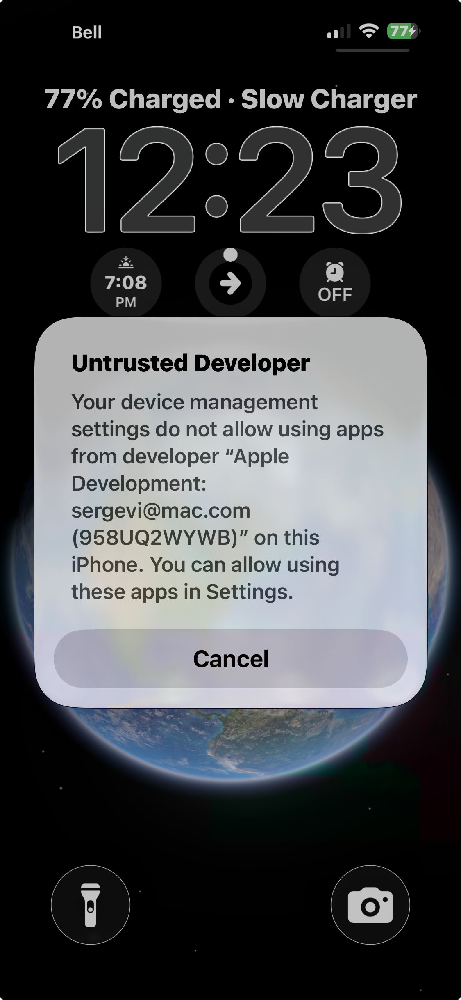 |

**Settings → General → VPN & Device Management** → select the developer certificate → **Trust**.

---

### Open in Xcode

```bash
cd maverick-obd-swift
xcodegen generate   # regenerate if project.yml changes
open MaverickOBD.xcodeproj
```

Set your **Development Team** in Signing & Capabilities → select your iPhone → **⌘R**.

---

## Hardware

**OBD-II Adapter:** V-LINK IOS-Vlink BLE (ELM327-compatible)

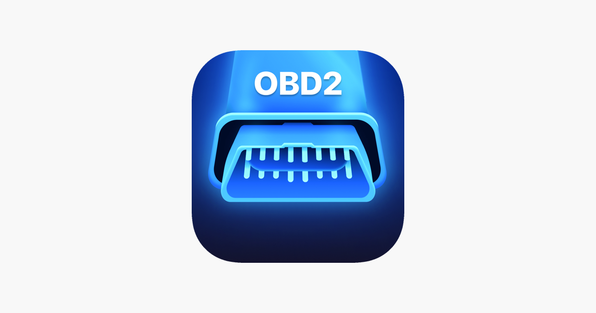

The adapter plugs into the OBD-II port (under the dash, driver's side). It communicates via Bluetooth Low Energy using the ELM327 AT command protocol.

**Supported BLE profiles:**

| Service UUID (prefix) | Profile |
|-----------------------|---------|
| `0000ffe0` | IOS-VLink / FFEx |
| `0000fff0` | V-LINK / FFFx |
| `6e400001` | Nordic UART Service |
| `49535343` | ISSC / V-LINK BLE |

**ELM327 init sequence:**

```
ATZ     → Reset
ATE0    → Echo off
ATL0    → Linefeeds off
ATS0    → Spaces off
ATH0    → Headers off
ATCAF0  → CAN auto-format off  ← required for IOS-Vlink
ATSP0   → Auto protocol
```

### IOS-Vlink verified with Car Scanner Pro

| ELM connected, ECU connecting | DTC scan — 4 of 21 modules |
|:-----------------------------:|:--------------------------:|
| 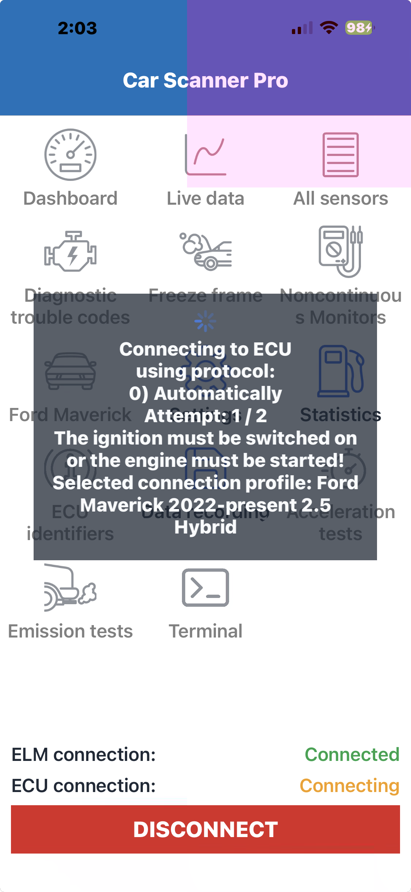 | 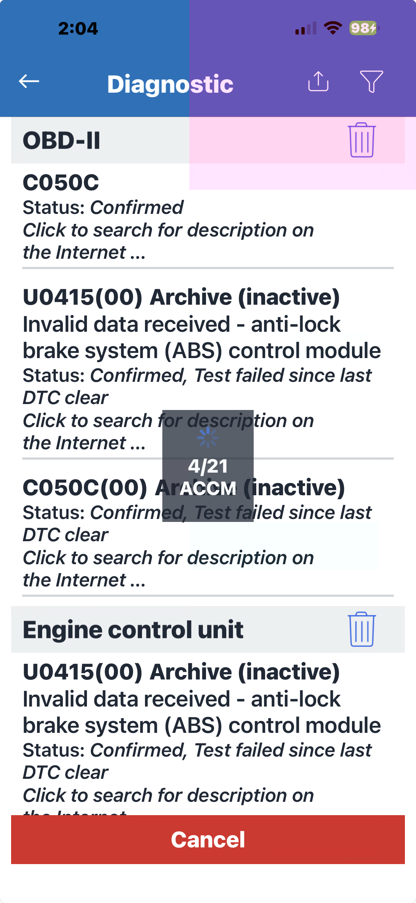 |

The IOS-Vlink adapter was validated against Car Scanner Pro before integration. Confirmed working on the Ford Maverick CAN bus (ISO 15765-4, 11-bit ID, 500 kbaud).

---

## Project Structure

```
maverick-command-core/
├── README.md
├── maverick-ecu-app/           ← Desktop ECU dashboard (Next.js 15, port 3009)
│   └── src/
│       ├── app/                ← Next.js pages + layout
│       ├── components/         ← Dashboard UI components
│       └── lib/
│           ├── bluetooth-service.ts   ← BLE connection + ELM327 init
│           └── obd-parser.ts          ← PID decoder
├── obd-flux-app/               ← OBD Flux Console (Next.js 15 + Capacitor, port 3017)
│   ├── src/
│   │   ├── app/                ← Next.js pages
│   │   ├── components/         ← obd-dashboard.tsx (main UI)
│   │   └── lib/ble/            ← adapterProfiles, obdBleClient, parser
│   ├── ios/                    ← Xcode project (Capacitor-generated)
│   └── capacitor.config.ts
├── maverick-obd-swift/         ← Native iPhone app (SwiftUI + CoreBluetooth)
├── assets/                     ← Screenshots and reference photos
└── Docs/                       ← ECU scan dumps, datasheets, codex handoffs
```

---

## Ports

| App              | Port | Notes |
|------------------|------|-------|
| maverick-ecu-app | 3009 | Web Bluetooth (Chrome desktop) |
| obd-flux-app     | 3017 | Capacitor web preview |

---

## Resources

- [OBD-II Mode 01 PID Reference](https://www.obdautodoctor.com/help/articles/supported-obd-parameters/)
- [ELM327 AT Command Set](https://www.elmelectronics.com/wp-content/uploads/2016/07/ELM327DS.pdf)
- [Capacitor iOS Docs](https://capacitorjs.com/docs/ios)
- [capacitor-community/bluetooth-le](https://github.com/capacitor-community/bluetooth-le)
- [Web Bluetooth API](https://developer.mozilla.org/en-US/docs/Web/API/Web_Bluetooth_API)
